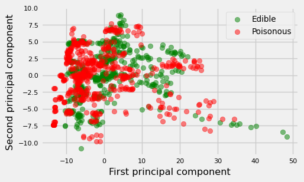
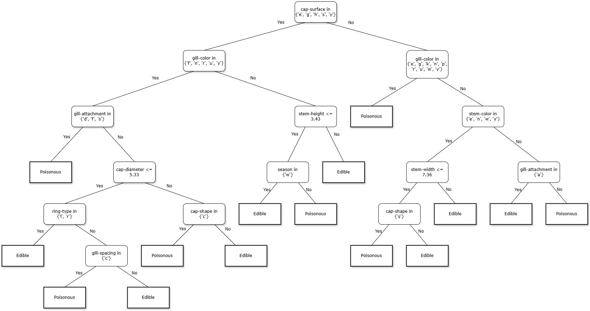

# Machine learning from scratch: Decision Tree Classifier


This project implements a fully functional **Decision Tree Classifier** from the ground up in Python,
without using high-level machine learning libraries like Scikit-learn for the core logic. 
Developed as part of the *Statistical Methods for Machine Learning* course at the University of
Milan, this project explores the internal mechanics of non-linear predictors, focusing on
algorithmic efficiency, recursive data structures, and statistical validation.

## 🚀 Key features
- **Native categorical support** Handles categorical attributes using power set membership tests, eliminating the need for one-hot encoding.
- **Modular splitting criteria** Implements multiple heterogeneity indices via an object-oriented approach:
  - **Gini index**
  - **Scaled entropy**
  - **Bernoulli standard deviation**
- **Robust stopping criteria** Includes hyperparameters for regularization:
  - `max_depth` Controls the height of the tree.
  - `min_samples_split` Minimum samples required to explore a split.
  - `min_impurity_decrease` Minimum information gain threshold for a new node.
- **Performance optimization** Implements unique value sampling to speed up training on large datasets without significantly sacrificing accuracy.

## 📊 Dataset: UCI mushrooms
The model is trained on the [UCI Mushroom dataset](https://archive.ics.uci.edu/ml/datasets/Mushroom), consisting of ~60k instances and 20 features. 
- **Preprocessing** Handles missing values (NaN) and performs Principal Component Analysis (PCA) for data visualization.
- **Performance** The custom implementation achieves a generalization accuracy of **~97%**, matching industry-standard implementations.

## 🔬 Scientific validation
To ensure the correctness of the implementation, the project includes rigorous sanity checks:
- **Label swapping test** A methodology where training labels are randomly shuffled to verify that the tree converges toward expected stochastic behavior (0.5 loss), proving the absence of data leakage.
- **Complexity analysis** Comparison of training times and accuracy against Scikit-learn's `DecisionTreeClassifier`.

## 📁 Project structure
- `Node` A class representing internal nodes (decision criteria) and leaves (labels).
- `TreePredictor` The core class handling the recursive `fit` and `predict` logic.
- `SplittingCriterion` An abstract base class for implementing modular heterogeneity indices.
- `report.pdf` A detailed LaTeX report covering the theoretical background and experimental results.

## 🛠 Installation & usage
1. **Clone the repository**
   ```bash
   git clone https://github.com/AlessandroDiGioacchino/statmeth-project.git
   ```

2. **Install dependencies**
   ```bash
   pip install numpy matplotlib pandas
   ```

3. **Run the analysis**  
   Open the provided Jupyter Notebook or Python script to train the model and generate performance plots.

## 📈 Visualizations
### Principal Component Analysis
<details>
  <summary>The dataset is projected into 2D space to understand class separability.</summary>
  
  
</details>

### Decision Tree Structure
<details>
  <summary>Example of a tree built using the Gini Index and specific stopping criteria.</summary>

  
</details>

## ✍️ Author
**Alessandro Di Gioacchino**  
Master's Degree in Computer Science - University of Milan.  
[LinkedIn](www.linkedin.com/in/alessandrodigioacchino) | [GitHub](github.com/AlessandroDiGioacchino)

## 📄 License
This project is licensed under the MIT License - see the LICENSE file for details.
